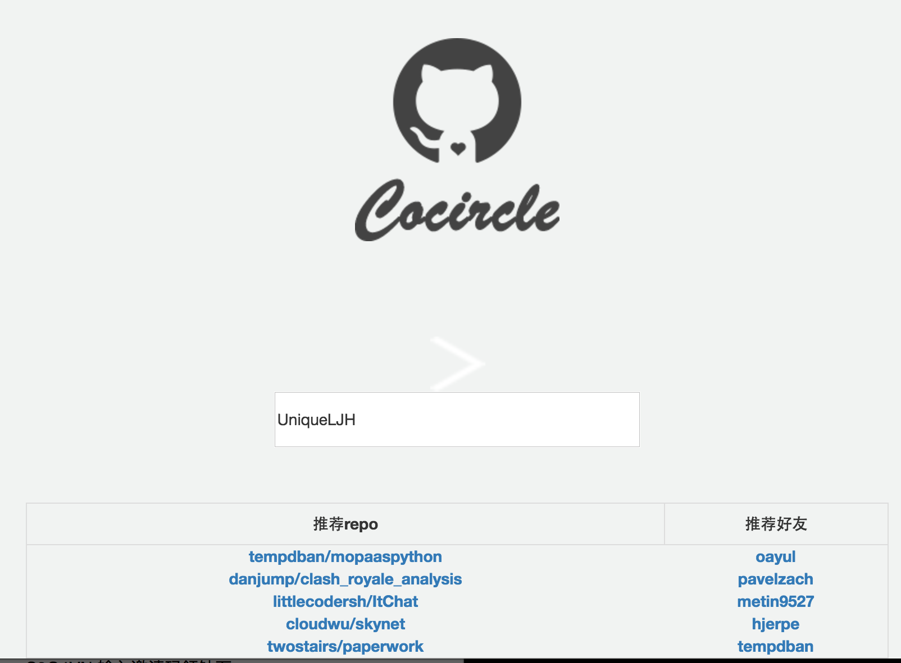
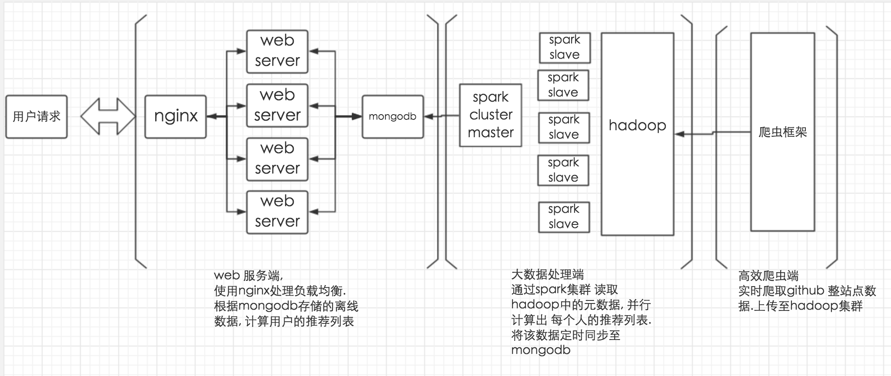

title: 武汉hackathon作品-Cocircle
date: 2016-11-06 21:18:05
tags:
---

##[Cocircle](http://54.222.171.185:8003/static/index.html)
是一款基于分析Github用户数据, 通过Spark计算用户相似度,以及基于相似用户的协同推荐应用.

##思路

1.  基于用户Star过的项目列表做相似度计算,每两个拥有共同Star repo的github用户.我们均会计算他们两人的相似度.
然后通过相似度的排序推荐好友.

2.  基于推荐好友的协同过滤推荐系统 我们为该用户推荐repo

##架构

##爬虫框架

使用并行爬虫框架[yascrapy](https://github.com/jianxunio/yascrapy),将Github整站点用户的Starlist爬取下来.
Github用户量在笔者参加2016武汉hackathon(2016.10.29)大约在2kw作用.爬虫框架中使用的是分片部署的mongodb.
选取mongodb的优势在于导出json数据格式方便. 当每次爬虫完成更新数据的任务时.都会自动将json数据交付大数据处理端的hadoop集群.
以hdfs.json文件供以Spark计算与处理.

##大数据处理端

Spark 集群的配置为 7个slave节点. 每个slave 分别是38核,2G内存, 在slave节点上部署了一个hadoop集群.同样是7个node节点.

在Spark处理数据的环节
我们的输入数据可以概括为

| github_id |  starlist |
| :-------: | :--------:|
| 1         | a,b,c     |
| 2         | b,c       |
| 3         | d         |
| 4         | a,c       |
 以上这个可以作为节点数据, 然后我们还需要使用节点数据,来生成一份relation数据, 用来标记哪两个用户需要计算相似度
 
 | repo       |      github_id_list |
 | :--------: | :------------------:|
 |  a         | 1,4                 |
 |b           | 1,2                 |
 |c           |  1,2,4              |
 |d           | 3                   |
 
 通过该表 可以 将github_id_list 生成(github_id1, github_id2)这类关系对
 
 |github_id_tuple|
 |:-------------:|
 |(1,4)|
 |(1,2)|
 
 使用关系对 通过两次join形式来进行相似度计算. 在两次join操作过程中节点间会产生巨大的数据传输数据.
 
 为此我们需要优化这个join操作
 
 使用二维图思想. github_id_tuple 实际上是一个 邻接矩阵 M[i, j] = 1时标识 i, j 需要计算相似度.
  
  例如案例中我们id 范围是 1-4. 矩阵应该是4x4. 我们将矩阵等分成4个区域. 将多个小区域聚合成一块较大的区域,来减少join过程中shuffle的压力
  
 | pid | github_id_tuple |
 | :-----: |:-------------:|
 |2|(1,4)|
 |1|(1,2)|
 使用二维花费的思想能够减少节点数据的复制分数. 而划分的粒度需要根据Spark集群的配置来调整
 
 通过相似度计算 然后根据好友推荐列表计算推荐repo的列表
 
 ##web server端
 因为时间紧张 我们在后台仅搭建一个十分简单的[页面](http://54.222.171.185:8003/static/index.html). 
  
 